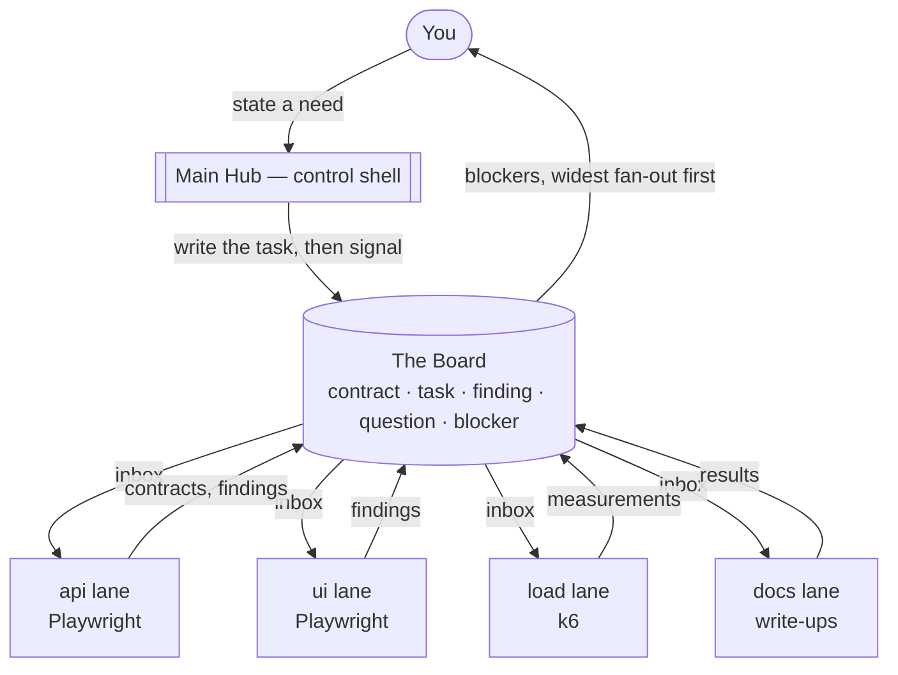

# Blackboard Hub

**A test framework where every layer is its own agent session, coordinated through shared state instead of through you.**

Playwright for API and UI, k6 for load, each running in its own session, its own
git worktree, its own branch — reading and writing one shared board.

---

## The idea it is built on

Imagine specialists in a room around a blackboard. Nobody follows a script. Each
watches the board, and when something appears that fits their expertise, they step
up and add what they know. The solution accretes.

That is the [blackboard system](https://en.wikipedia.org/wiki/Blackboard_system) —
an AI architecture from the 1970s (Hearsay-II, later BB1 and GBB) for problems too
ill-defined for top-down planning. The board is described as a dynamic
["library" of contributions to the current problem](https://en.wikipedia.org/wiki/Blackboard_system).

It has three parts, and this repo is a direct mapping of them:

| Blackboard system | Here |
| --- | --- |
| **Blackboard** — shared, published, readable by all | `board/` — append-only logs, folded into current state |
| **Knowledge sources** — specialists who contribute opportunistically | **Lanes**: `api`, `ui`, `load`, `docs`, each its own session |
| **Control shell** — stops everyone grabbing the chalk at once | The **Main Hub** session |

**The problem it solves:** run five agent sessions on one codebase and *you*
become the message bus, copy-pasting state between windows. Transcripts can't be
shared — they compact, they're prose, and no other session can read them. The
board replaces you with a surface every lane can query.

---

## How it flows



---

## Quickstart

```bash
npm install
npm run test:board
```

Then look at the board:

```bash
npm run board -- status    # who is live, who has stalled, per-lane git state
npm run board -- queue     # what is blocked, and how many lanes each blocker gates
```

Run the suites — Playwright builds and serves the app under test itself, so
there is no "start the app first" step:

```bash
npm run test:api     # Playwright, HTTP surface only, no browser
npm run test:ui      # Playwright, browser
npm run test:load    # k6 (needs a running instance)
```

---

## Three rules that make it work

### 1. Messages are signals; the board is the record

Lanes may message each other directly, but a side conversation between two lanes
is exactly the invisible state this exists to remove. Anything that matters gets
written to the board regardless of how it was communicated.

> If it is not on the board, it did not happen.

### 2. One owner per entry

Each entry declares an owning lane. Others read it; only the owner supersedes it —
enforced by the CLI, not by convention:

```console
$ board append --lane api --id question_11520c87 --status answered
board: entry question_11520c87 is owned by "ui"; "api" cannot supersede it.
       raise a question entry addressed to the hub instead.
```

Cross-lane disagreement therefore surfaces as an explicit `question` for the hub
to arbitrate, instead of one lane silently overwriting another.

### 3. Derive what tools already know

Branch, ahead/behind, and dirty counts are scraped from git, never typed by a
lane. Hand-maintained facts rot silently; `git status` does not.

---

## The human is a resource with a queue

The most valuable thing on the board is usually what is stuck on *you* — and one
answer often releases several lanes at once. `queue` sorts by fan-out, so the top
line is the single answer that buys the most:

```console
$ npm run board -- queue
WAITING ON HUMAN
  blocker_c319f4ae  staging BASE_URL not published  [gates 2 lanes: load, ui]
      raised by load, 25h ago

WAITING ON A LANE
  blocker_935b8d8d  need internal service names  [gates api]
      raised by api, 2h ago
```

---

## Layout

Each lane works in its own linked worktree on its own branch, so lanes cannot
collide in one working tree and `status` reports real per-lane state:

```
blackboard_hub/          main        <- hub session, and the one board
hub-lanes/api            lane/api
hub-lanes/ui             lane/ui
hub-lanes/load           lane/load
hub-lanes/docs           lane/docs
```

Worktrees hand each lane its own copy of `board/`, which would silently produce
five private boards. The CLI resolves the board from the main checkout via
`git rev-parse --git-common-dir` so every lane shares one. `board where` prints
the resolved path; if two lanes disagree, they are isolated.

---

## Board commands

```
board append --lane <l> --type <t> [--title <s>] [--body <s>] [--id <id>]
             [--status <s>] [--refs a,b] [--to <lane>] [--waiting-on human|<lane>]
board read   [--type t] [--owner l] [--status s] [--to l] [--waiting-on x] [--json]
board show   <id>        every revision of one entry, oldest first
board queue              what is blocked, and how many lanes each blocker gates
board status             per-lane liveness and derived git state
board lanes              the registry
board where              resolved board path (identical from every worktree)
```

**Types:** `contract` · `task` · `finding` · `question` · `blocker`
**Statuses:** `open` · `answered` · `blocked` · `done` · `superseded`

Entries are revised by re-appending under the same `--id`. Updates are partial:
passing `--status` alone preserves title, body, refs and routing.

---

## Where this departs from the classic model

Honest caveats, not marketing:

- **Activation is push, not opportunistic.** Classic knowledge sources *watch*
  the blackboard and fire when it changes. Nothing here watches — the hub
  dispatches, or you do.
- **Unattended sessions can't be signalled.** Scheduled and remote runs can
  neither send nor receive session messages, so a cron-driven lane can write to
  the board but cannot be woken.
- **CI results have no author.** Tests run in containers, where no lane session
  exists to record what happened. Getting those findings onto the board is unsolved.

---

## Agent skills

Two skills encode the protocol so a session knows its role:

- **`hub`** — receive intent, resolve a lane to a live session, dispatch, arbitrate.
- **`lane`** — read your inbox, work in your worktree, write results back, raise blockers.

---

## Tests

```bash
npm run test:board     # 22 checks: ownership, fold semantics, fan-out, board sharing
npx playwright test    # 8 tests against the app under test
```

`test/shared-board.sh` exists because the private-board bug was found by hand and
nothing in the suite would have caught it. It also names any lane running a stale
CLI.

Design rationale and the reasoning behind each decision: [docs/design.md](docs/design.md).
